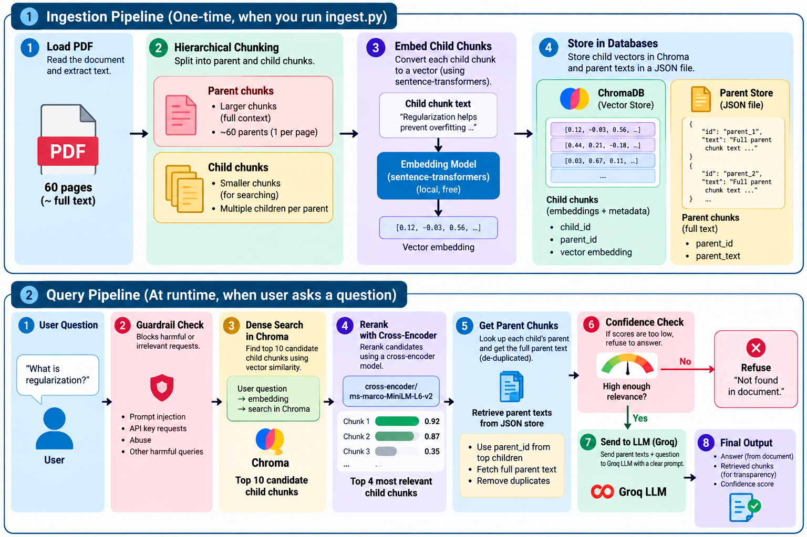

# Agentic AI RAG Chatbot

A RAG-based chatbot that answers questions strictly from the **Agentic AI eBook** (Konverge AI). Built with Groq, ChromaDB, and LangGraph.

Given a question, it retrieves the most relevant parts of the book, checks how confident it actually is, and either answers from that context or tells you honestly that it couldn't find the answer ,it doesn't make things up.

---

## How it works (architecture)




### Why it's built this way

**Hierarchical (parent-child) chunking** — Instead of one flat chunk size, we search on small precise chunks but hand the LLM the full parent section as context. Small chunks match questions more accurately; big parents give the LLM enough surrounding context to actually answer well. This avoids the common RAG problem of "the right chunk matched, but it's cut off mid-sentence with no context."

**Reranking** — Dense vector search (embeddings) is fast but approximate. We pull a wider net of candidates from Chroma, then use a cross-encoder reranker to score each candidate against the actual question much more precisely, before picking the final top matches.

**Confidence score** — This is the top reranker score after normalizing it to 0–1. If it's below a threshold, we don't even bother asking the LLM — we return the "not found" message directly. This keeps answers grounded and avoids hallucination on questions the book doesn't cover.

**Guardrails** — Before anything else runs, the question is checked against basic prompt-injection patterns, requests for API keys/secrets, and profanity. Blocked questions never reach retrieval or the LLM at all.

**LangGraph** — The whole flow (guardrail → retrieve → generate, or guardrail → refuse) is built as a small state graph rather than a single function. Each step reads and writes to one shared state object, and routing between steps is conditional (e.g. blocked questions skip straight to refuse).

**Known limitation:** the PDF has diagrams, charts, and images. Text extraction pulls out the text inside them, but loses the visual layout/relationships (which label belongs to which box, etc). For a text-only RAG pipeline this is a standard tradeoff — a future improvement would be OCR or vision-based extraction for image-heavy pages.

---

## Project structure

```
app/
  api/           - FastAPI routes (/chat, /ingest, /health)
  ingestion/     - PDF loading, chunking, ingestion pipeline
  embeddings/    - local embedding model wrapper
  vectorstore/   - Chroma client + parent text store
  retriever/     - retrieval + reranking
  graph/         - LangGraph pipeline (guardrails, nodes, state)
  llm/           - Groq client + prompts
  config.py      - all settings, loaded from .env
data/
  raw/           - put the source PDF here
  vector_db/     - Chroma DB + parent store (generated by ingestion)
scripts/
  ingest.py      - run ingestion from the command line
  test_api.py    - sample query test script
tests/           - unit tests for each component
```

---

## Setup

### 1. Clone and install

```bash
git clone <your-repo-url>
cd rag-chatbot-agentic-ai
python -m venv venv
venv\Scripts\activate        # Windows
pip install -r requirements.txt
```

### 2. Add your API keys


```env
GROQ_API_KEY=your_groq_key_here
HF_TOKEN=your_huggingface_token_here  
```

### 3. Add the PDF

```
data/raw/agentic-ai-ebook.pdf
```

### 4. Ingest the document

```bash
python scripts/ingest.py
```

### 5. Run the API

```bash
python -m app.main
```

Open **http://localhost:8000/docs** to try it in the browser, or use the endpoints directly:

- `GET /health` — check the server is up
- `POST /ingest` — re-run ingestion (e.g. if you swap the PDF)
- `POST /chat` — ask a question

Example:
```bash
curl -X POST http://localhost:8000/chat -H "Content-Type: application/json" -d "{\"question\": \"What is agentic AI?\"}"
```

Response shape:
```json
{
  "answer": "...",
  "retrieved_chunks": [
    { "parent_id": "parent_1", "text": "...", "similarity_score": 0.99 }
  ],
  "confidence_score": 0.99
}
```

### 6. Run tests


```bash
python -m pytest tests/ -s
```


## Tech stack

- **LLM**: Groq (`llama-3.1-8b-instant`)
- **Embeddings**: sentence-transformers, `all-MiniLM-L6-v2` (local, free)
- **Reranker**: cross-encoder, `ms-marco-MiniLM-L-6-v2`
- **Vector DB**: ChromaDB (local, persistent)
- **Orchestration**: LangGraph
- **API**: FastAPI